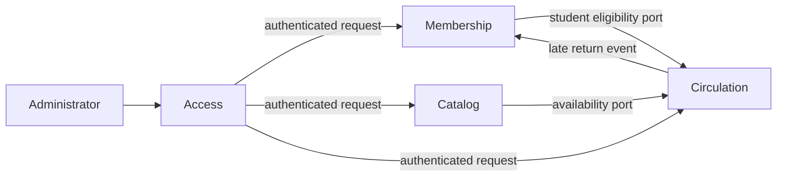

# Context Map — LMS Library

## Relationships

| Upstream context | Downstream context | Relationship | Contract |
| --- | --- | --- | --- |
| Access | All administrative modules | Customer/Supplier | Valid administrator token and authenticated request context |
| Membership | Circulation | Published language | Student identity, active status, suspension status, and active-loan count |
| Catalog | Circulation | Published language | Book identity and atomic availability reservation/release |
| Circulation | Membership | Conformist event consumer | `LoanReturnedLate` requests a seven-day suspension |
| Administrator | All contexts | Primary actor | REST API through the edge proxy |

## Boundary rules

- The Circulation context owns loan lifecycle decisions and must not write Membership or Catalog tables directly.
- Membership owns student eligibility data; Catalog owns book metadata and availability.
- Cross-context calls use application ports. Future external integrations must be translated through an anti-corruption layer.
- In MVP 1, communication is synchronous in-process calls plus in-process domain events. A broker is not required.
