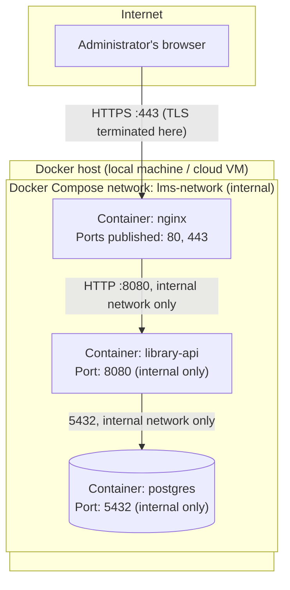

# Deployment Architecture

> How LMS-LIBRARY-V1 is deployed in each environment: infrastructure diagram, what runs in
> Docker, network configuration, and hardware requirements.

---

## 1. Infrastructure diagram



Only `nginx` publishes ports to the outside world. `library-api` and `postgres` are reachable
only from other containers on the same internal Docker network — never directly from the
Internet.

---

## 2. What runs in Docker

| Container | Image base | Built from | Persistent volume |
|-----------|-----------|------------|-------------------|
| `nginx` | `nginx:alpine` | `deploy/nginx/Dockerfile` (copies the React production build + `nginx.conf`) | None (stateless) |
| `library-api` | `golang:1.21-alpine` (multi-stage build → distroless/alpine runtime) | `Dockerfile` at repo root of the Go service | None (stateless) |
| `postgres` | `postgres:16-alpine` | Official image, env-configured | `pgdata` (named volume) — the only stateful container |

**Compose file layout (conceptual — actual file lives in `10-devops/` once written):**

```yaml
services:
  nginx:
    build: ./deploy/nginx
    ports: ["80:80", "443:443"]
    depends_on: [library-api]
    networks: [lms-network]

  library-api:
    build: .
    expose: ["8080"]
    env_file: .env
    depends_on: [postgres]
    networks: [lms-network]

  postgres:
    image: postgres:16-alpine
    expose: ["5432"]
    volumes: ["pgdata:/var/lib/postgresql/data"]
    env_file: .env
    networks: [lms-network]

volumes:
  pgdata:

networks:
  lms-network:
    driver: bridge
```

---

## 3. Network configuration

| Rule | Detail |
|------|--------|
| Externally reachable ports | `80` (redirects to 443), `443` — both on `nginx` only |
| Internal-only ports | `8080` (`library-api`), `5432` (`postgres`) — not published to the host |
| Inter-container communication | Over the `lms-network` bridge network, by service name (`nginx` → `http://library-api:8080`, `library-api` → `postgres:5432`) |
| TLS | Terminated at `nginx`; internal traffic (`nginx` → `library-api` → `postgres`) is plain HTTP/TCP within the trusted Docker network |

---

## 4. Environments

| Environment | Purpose | Where it runs | Notes |
|-------------|---------|---------------|-------|
| Local | Each developer's machine | `docker compose up` on the developer's laptop | Self-signed cert or plain HTTP acceptable (see `01-context/scope.md`) |
| Development (dev) | Shared testing as features land | Same Docker Compose topology, deployed to a shared VM/cloud instance | First environment reachable by the whole team |
| Staging | Not planned for v1 | — | Dev doubles as pre-prod — small academic team (`01-context/scope.md`) |
| Production | Demo / final delivery environment | Cloud-hosted where possible (virtualized infrastructure), per the product brief | Same Docker Compose topology; HTTPS mandatory (NFR-004) |

---

## 5. Hardware requirements

| Resource | Local/Dev | Production (demo scale) |
|----------|-----------|--------------------------|
| CPU | 2 vCPU | 2 vCPU (per `04-requirements/non-functional.md` NFR-003 — up to 3 instances of `library-api` if ever needed) |
| RAM | 4 GB | 4 GB |
| Disk | 10 GB (mostly Docker images + Postgres data at academic scale) | 10–20 GB, depending on backup retention |

> Figures are conservative estimates for an academic-scale deployment (low hundreds/thousands
> of books and students, `01-context/scope.md` assumption #4) — not a capacity-planning
> exercise for production traffic.

---

## 6. Correlations

- Reverse proxy decision → `05-architecture/decisions/records/ADR-003-nginx-reverse-proxy.md`
- Architectural style → `05-architecture/decisions/records/ADR-002-hexagonal-modular-monolith.md`
- Local setup instructions (once written) → `10-devops/local-setup.md`
- Environments referenced from scope → `01-context/scope.md`
- NFRs that constrain this deployment (HTTPS, RTO/RPO, scaling) → `04-requirements/non-functional.md`
