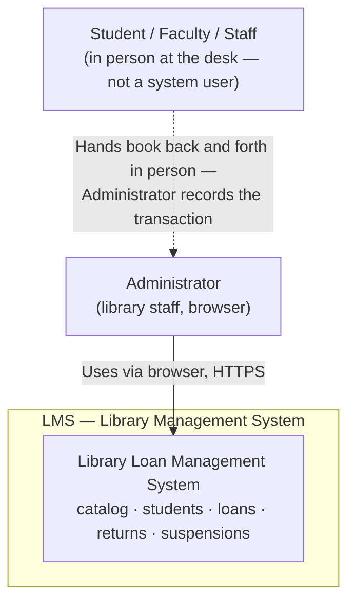
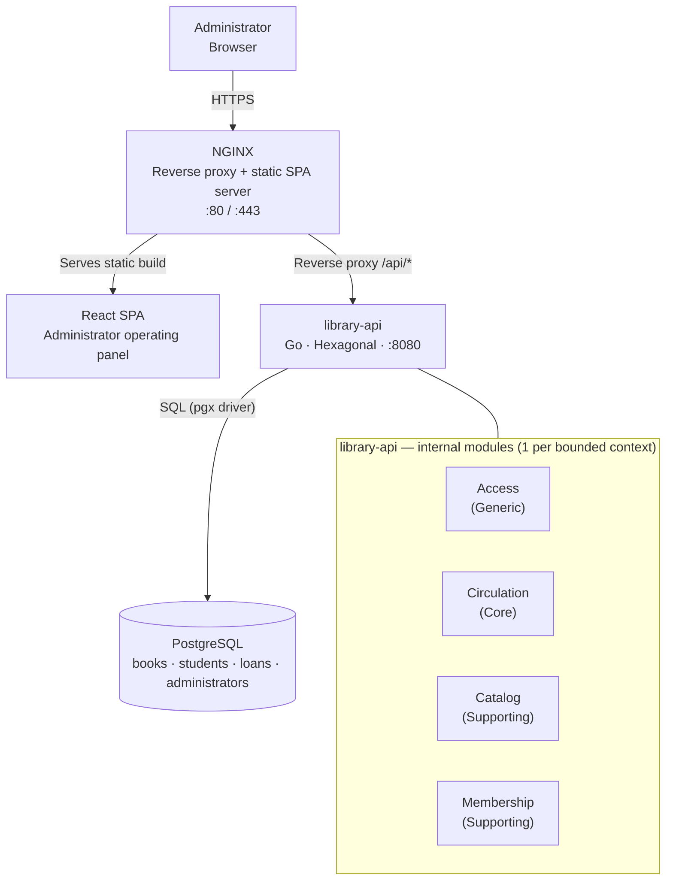

# System Architecture Overview

---

## 1. Adopted architectural style

**Style:** Hexagonal Modular Monolith, microservices-ready — a single deployable Go service
(`library-api`) internally organized into one module per bounded context (Access, Circulation,
Catalog, Membership), each built with Ports & Adapters so it can be extracted into its own
microservice later without rewriting business logic.

**Justification:** the domain work in `02-domain/domain-map.md` identified 4 bounded contexts
but no confirmed need for independent scaling (`01-context/scope.md`, assumption #4 — low
hundreds/thousands of records). A 3-person academic team, one term, cannot realistically
operate 4 deployables, a message broker, and a database per service. A hexagonal modular
monolith keeps the domain isolated and testable now, while preserving a low-risk path to real
microservices if the project ever needs to scale that way.

**Reference ADR:** [`ADR-002-hexagonal-modular-monolith.md`](decisions/records/ADR-002-hexagonal-modular-monolith.md)

---

## 2. C4 Diagram — System Level (Context)

> There is only one direct system actor in v1: the Administrator. Students/faculty/staff never
> log in — see `01-context/overview.md` and `02-domain/domain-map.md`.

---

## 3. C4 Diagram — Container Level

> No message broker in v1 — cross-module events (`LoanRegistered`, `LoanReturned`,
> `StudentSuspended`, see `02-domain/domain-events.md`) are raised and handled in-process,
> inside the same request/transaction.

---

## 4. Service catalog

| # | Service | Responsibility | Port | DB | Communication type |
|---|---------|---------------|------|-----|-------------------|
| 1 | `nginx` | Reverse proxy, TLS termination, serves the React SPA static build, basic rate limiting | 80 / 443 | — | HTTP Proxy |
| 2 | `library-api` | All business logic: authentication, catalog, students, loans, returns, suspensions | 8080 (internal) | PostgreSQL | REST (sync) + in-process events |
| 3 | `postgres` | Persistence for all entities (Book, Student, Loan, Administrator) | 5432 (internal) | — | SQL |

**Internal modules of `library-api`** (not separate deployables — see `ADR-002`):

| Module | Bounded Context | Type | Main entity |
|--------|-----------------|------|-------------|
| `access` | Access | Generic | Administrator |
| `circulation` | Circulation | Core | Loan |
| `catalog` | Catalog | Supporting | Book |
| `membership` | Membership | Supporting | Student |

> Full detail per module, once this project reaches that phase, in `09-microservices/service-catalog.md`

---

## 5. Architectural principles

### P1: API-First
Design the REST API contract (OpenAPI) in `07-api/contracts/openapi/` before implementing each
endpoint. The contract is the source of truth for the React SPA.

### P2: Modular Monolith Now, Microservices-Ready Later
One deployable service (`library-api`), one shared PostgreSQL database in v1 — **not**
database-per-service, by deliberate choice (see `ADR-002`). Module boundaries mirror the
bounded contexts in `02-domain/domain-map.md` so a module can be promoted to its own service
(with its own database) later without a domain rewrite.

### P3: Fail Fast at the Edge
Validate input at the HTTP handler (primary adapter) before it reaches the domain. There are no
external service dependencies in v1, so no Circuit Breaker is needed yet — this principle is
revisited if the system ever calls another service (see "Planned evolution" below).

### P4: Observability by Design
Structured JSON logs with a correlation ID, `GET /health` / `GET /health/ready` endpoints, and
metrics/tracing planned per `04-requirements/non-functional.md` (NFR-005) from the start — not
deferred to "later".

### P5: Minimal Infrastructure Footprint
Given the academic scope and 3-person team (`01-context/scope.md`, Constraints), the system
deliberately avoids infrastructure it cannot operate: no Kubernetes, no message broker, no
managed API Gateway product. Docker Compose + NGINX + PostgreSQL is the whole v1 footprint.

---

## 6. Adopted architectural patterns

| Pattern | Adopted | Reference |
|---------|---------|-----------|
| API Gateway | Partial — NGINX as reverse proxy, not a full gateway product | `ADR-003`, `05-architecture/pattern-guide.md` |
| Database per Service | No — single service, single shared DB in v1 | `ADR-002` |
| CQRS | No — read/write volume does not justify it at this scale | `05-architecture/pattern-guide.md` |
| Event Sourcing | No | `05-architecture/pattern-guide.md` |
| Circuit Breaker | No — no external service dependencies in v1 | `05-architecture/pattern-guide.md` |
| Saga (choreographed) | No — single DB, ACID transactions are sufficient | `05-architecture/pattern-guide.md` |
| Outbox Pattern | No — domain events are in-process, not published externally (`02-domain/domain-events.md`) | `05-architecture/pattern-guide.md` |

---

## 7. Cross-cutting concerns

| Concern | Adopted solution | Where it is configured |
|---------|----------------|------------------------|
| Authentication / Authorization | JWT issued and validated **inside `library-api`** (NGINX does not do authn/authz — see `ADR-003`) | `internal/infrastructure/http/` middleware in `library-api` |
| Logging | Structured JSON + Correlation ID | Shared logger package (`zap`), per `04-requirements/non-functional.md` NFR-005 |
| Tracing | OpenTelemetry (planned; manual log review acceptable at academic scale) | Middleware in `library-api` |
| Health Checks | `GET /health` (liveness) + `GET /health/ready` (readiness) | `library-api` |
| Error format | Standard `ErrorResponse` | `07-api/contracts/openapi/_shared.yaml` (once written) |
| Rate Limiting | At NGINX (`limit_req` directive) | `05-architecture/deployment.md` |
| CORS | Configured in `library-api` HTTP middleware | `internal/infrastructure/http/` |
| Circuit Breaker | Not applicable in v1 — no external service calls | — |

> See full detail in `05-architecture/cross-cutting.md`.

---

## 8. Registered architectural technical debt

| ID | Description | Impact | Priority | Target sprint |
|----|-------------|--------|---------|--------------|
| AT-001 | All 4 bounded-context modules share one PostgreSQL database instead of database-per-service | Medium — must be resolved before any module can be split into its own microservice | P3 | Revisit only if v2 requires splitting a module |
| AT-002 | No message broker — cross-module events are in-process, so they would need to be re-implemented as real async events if a module is ever extracted | Medium — blocks true independent deployability of a single module | P3 | Revisit only if v2 requires splitting a module |

> See also: `15-project-control/technical-backlog.md`

---

## 9. Planned evolution

| Version | Architectural change | Motivation | Estimated date |
|---------|---------------------|------------|----------------|
| v2 (candidate) | Extract one or more modules (most likely Catalog) into its own microservice, with its own database | Only if a future course phase or real deployment needs independent scaling — no confirmed need today | Not scheduled |
| v2 (candidate) | Introduce a message broker (Kafka/RabbitMQ) to replace in-process domain events | Required as soon as any module is split, per `AT-002` | Not scheduled |
| v2 (candidate) | Replace NGINX with a full API Gateway (Kong/Traefik) | Required only if multiple backend services need central routing | Not scheduled |

---

## Key correlations

- Domain bounded contexts → `02-domain/domain-map.md`
- Specific decision ADRs → `05-architecture/decisions/`
- Hexagonal architecture per module → `05-architecture/hexagonal-architecture.md`
- Applied patterns → `05-architecture/pattern-guide.md`
- Deployment topology → `05-architecture/deployment.md`
- Cross-cutting concerns detail → `05-architecture/cross-cutting.md`
- Threat model → `05-architecture/security-threat-model.md`
- Per-module detail → `09-microservices/service-catalog.md`
- UML diagrams → `08-uml/`
