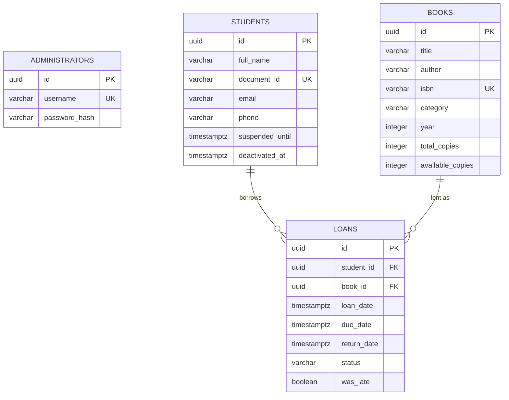

# Data Model — LMS-LIBRARY-V1

> **Deviation from the "Database per Service" default:** per `ADR-002-hexagonal-modular-monolith.md`,
> LMS-LIBRARY-V1 ships as a single deployable service (`library-api`) with one shared
> PostgreSQL database in v1 — not one database per bounded context. This is tracked as
> architectural debt `AT-001` in `05-architecture/overview.md`. The tables below are still
> grouped by the bounded context that owns them, so the seams needed for a future split
> already exist at the schema level.

**DB Engine:** PostgreSQL 16.

**Engine justification:** relational integrity is required between `students`, `books`, and
`loans` (a loan must reference a valid student and book), and ACID transactions are required
when a loan is registered (decrement `available_copies` and insert the loan row atomically) —
see `02-domain/entities-and-rules.md`, INV-002 on Loan. No document/key-value features are
needed at this scale.

---

## Module: Access (owns `administrators`)

### Table: `administrators`

**Purpose:** the single authenticated role that operates the system (`02-domain/entities-and-rules.md`, Entity: Administrator).

```sql
CREATE TABLE administrators (
  id              UUID        PRIMARY KEY DEFAULT gen_random_uuid(),

  username        VARCHAR(100) NOT NULL UNIQUE,
  password_hash   VARCHAR(255) NOT NULL,

  created_at      TIMESTAMPTZ NOT NULL DEFAULT NOW(),
  updated_at      TIMESTAMPTZ NOT NULL DEFAULT NOW()
);

CREATE UNIQUE INDEX idx_administrators_username ON administrators (username);
```

**No soft delete:** administrators are provisioned directly in the database (not through a
public registration endpoint, see `02-domain/entities-and-rules.md`), so there is no
end-user-facing deactivation flow to support in v1.

---

## Module: Membership (owns `students`)

### Table: `students`

**Purpose:** people authorized to borrow books, managed entirely by the Administrator
(`02-domain/entities-and-rules.md`, Entity: Student).

```sql
CREATE TABLE students (
  id                UUID        PRIMARY KEY DEFAULT gen_random_uuid(),

  full_name         VARCHAR(200) NOT NULL,
  document_id       VARCHAR(50)  NOT NULL UNIQUE,
  email             VARCHAR(255) NOT NULL,
  phone             VARCHAR(30),

  suspended_until   TIMESTAMPTZ,          -- NULL = not suspended
  deactivated_at    TIMESTAMPTZ,          -- NULL = active (soft delete, HU-03)

  created_at        TIMESTAMPTZ NOT NULL DEFAULT NOW(),
  updated_at        TIMESTAMPTZ NOT NULL DEFAULT NOW()
);

CREATE UNIQUE INDEX idx_students_document_id ON students (document_id);
CREATE INDEX idx_students_active ON students (deactivated_at) WHERE deactivated_at IS NULL;
CREATE INDEX idx_students_suspended_until ON students (suspended_until) WHERE suspended_until IS NOT NULL;
```

**Data dictionary excerpt:**

| Column | Type | Description | Example |
|--------|------|-------------|---------|
| document_id | VARCHAR(50) | Institutional ID/document code — business key used at the circulation desk | `1075300000` |
| suspended_until | TIMESTAMPTZ \| NULL | Set to `now() + 7 days` on a late return (INV on Loan); cleared automatically once it elapses (no stored "cleared" event — checked at read time) | `2026-09-02T00:00:00Z` |
| deactivated_at | TIMESTAMPTZ \| NULL | Soft delete marker for HU-03 deactivation; blocked while the student has active loans or an active suspension | `NULL` |

**Modeling decisions:**
1. Soft delete (`deactivated_at`) instead of a hard `DELETE`, so loan history referencing a
   deactivated student is never orphaned.
2. `suspended_until` is a plain nullable timestamp, not a separate `suspensions` table — v1 uses
   a single flat 7-day suspension per late return, not a history of overlapping suspensions
   (`02-domain/entities-and-rules.md`).

---

## Module: Catalog (owns `books`)

### Table: `books`

**Purpose:** the book catalog and copy-count availability tracking
(`02-domain/entities-and-rules.md`, Entity: Book).

```sql
CREATE TABLE books (
  id                 UUID        PRIMARY KEY DEFAULT gen_random_uuid(),

  title              VARCHAR(300) NOT NULL,
  author             VARCHAR(200) NOT NULL,
  isbn               VARCHAR(20)  NOT NULL UNIQUE,
  category           VARCHAR(100) NOT NULL,
  year               INTEGER      NOT NULL,

  total_copies       INTEGER      NOT NULL CHECK (total_copies >= 1),
  available_copies   INTEGER      NOT NULL CHECK (available_copies >= 0 AND available_copies <= total_copies),

  created_at         TIMESTAMPTZ NOT NULL DEFAULT NOW(),
  updated_at         TIMESTAMPTZ NOT NULL DEFAULT NOW()
);

CREATE UNIQUE INDEX idx_books_isbn ON books (isbn);
-- Supports HU-05 catalog search by title/author/category:
CREATE INDEX idx_books_title ON books (title);
CREATE INDEX idx_books_author ON books (author);
CREATE INDEX idx_books_category ON books (category);
```

**Modeling decisions:**
1. No separate `copies` table in v1 — `available_copies`/`total_copies` are plain counters on
   `books`, per the explicit modeling note in `02-domain/entities-and-rules.md` ("why there is
   no separate Copy entity"). Individual copy identity/condition is out of scope
   (`01-context/scope.md`, out of scope #8).
2. No soft delete on `books` — the backlog (`04-requirements/user-stories.md`) has no HU for
   deleting a book, only registering (HU-04) and editing (HU-09).

---

## Module: Circulation (owns `loans`)

### Table: `loans`

**Purpose:** the record of a book copy lent to a student
(`02-domain/entities-and-rules.md`, Entity: Loan — Core Domain).

```sql
CREATE TABLE loans (
  id              UUID        PRIMARY KEY DEFAULT gen_random_uuid(),

  student_id      UUID        NOT NULL REFERENCES students(id) ON DELETE RESTRICT,
  book_id         UUID        NOT NULL REFERENCES books(id)    ON DELETE RESTRICT,

  loan_date       TIMESTAMPTZ NOT NULL,
  due_date        TIMESTAMPTZ NOT NULL,          -- always loan_date + 7 days (INV-001 on Loan)
  return_date     TIMESTAMPTZ,                   -- NULL while active
  status          VARCHAR(20) NOT NULL DEFAULT 'ACTIVE'
                  CHECK (status IN ('ACTIVE', 'RETURNED')),
  was_late        BOOLEAN,                       -- set when returned; NULL while active

  created_at      TIMESTAMPTZ NOT NULL DEFAULT NOW(),
  updated_at      TIMESTAMPTZ NOT NULL DEFAULT NOW()
);

CREATE INDEX idx_loans_student_id ON loans (student_id);
CREATE INDEX idx_loans_book_id ON loans (book_id);
-- Supports HU-06 INV-004 (max 2 active loans per student) and HU-08 (overdue query):
CREATE INDEX idx_loans_status_due_date ON loans (status, due_date);
```

**Modeling decisions:**
1. `ON DELETE RESTRICT` on both foreign keys — a student or book referenced by any loan
   (active or historical) can never be hard-deleted, matching the soft-delete decision on
   `students` and the no-delete decision on `books`.
2. `was_late` is stored (not recomputed from `return_date > due_date` on every read) so loan
   history (HU-07) doesn't need to keep `due_date` semantics stable forever to answer "was this
   late" — it's a fact captured at return time.
3. No separate `overdue` status — "overdue" is a derived read (`status = 'ACTIVE' AND due_date < now()`),
   not a stored state, avoiding a background job to keep it in sync (`02-domain/entities-and-rules.md`
   already treats `isOverdue()` as a computed method, not a stored field).

---

## Entity-relationship diagram



---

## Correlations

- Domain entities and invariants these tables implement → `02-domain/entities-and-rules.md`
- Field-by-field business meaning → `06-data/data-dictionary.md`
- Naming and audit conventions applied above → `06-data/modeling-conventions.md`
- How this schema evolves → `06-data/migration-strategy.md`
- Shared-DB architectural debt this schema carries → `05-architecture/overview.md` (AT-001)
- What each endpoint exposes from this schema → `07-api/contracts/openapi/library-api.yaml`
